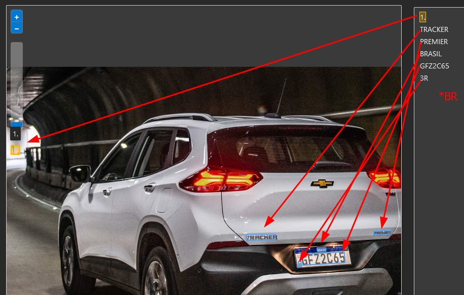

## Entrega do exercício da aula "Reconhecimento Facial e transformação de imagens em Dados no Azure ML"
---

Durante o laboratório dessa aula, experimentamos algumas funcionalidades do Vision Studio do AzureAI. 
Realizamos 3 experimentos do Vision Studio, sendo eles:
* Detecção de faces: https://microsoftlearning.github.io/mslearn-ai-fundamentals/Instructions/Labs/04-face.html
* Reconhecimento e leitura de textos (Optical Character Recognition): https://microsoftlearning.github.io/mslearn-ai-fundamentals/Instructions/Labs/05-ocr.html
* Análise de imagens: https://microsoftlearning.github.io/mslearn-ai-fundamentals/Instructions/Labs/03-image-analysis.html

Foi possível verificar a usabilidade do Visio Studio, assim como a velocidade para processar as informações. Ele também fornece um json de saída com as informações mapeadas na imagem. Além disso, contém uma documentação detalhada para utilizar a SDK em várias linguagens (com [exemplos](https://learn.microsoft.com/en-us/azure/ai-services/computer-vision/quickstarts-sdk/image-analysis-client-library-40?tabs=visual-studio%2Clinux&pivots=programming-language-rest-api)).

Durante os testes, ao submeter uma imagem de um veículo para identificar a placa via OCR, foi possível verificar que além da placa, ele conseguiu ler também o modelo e outras informações do veículo, apesar de ter gerado o texto "1." e o "3R" ao invés de "BR":
